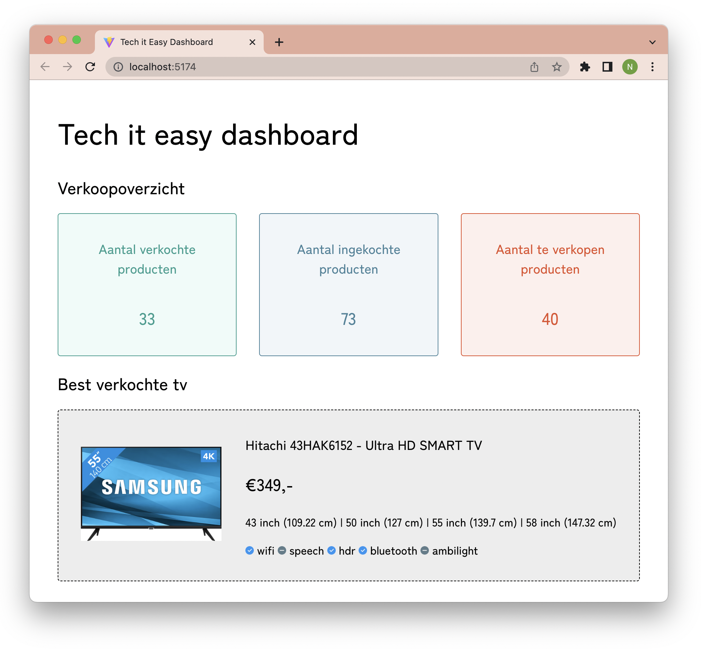
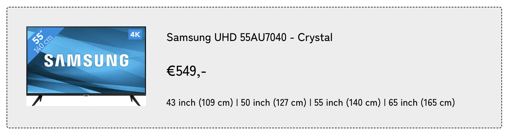
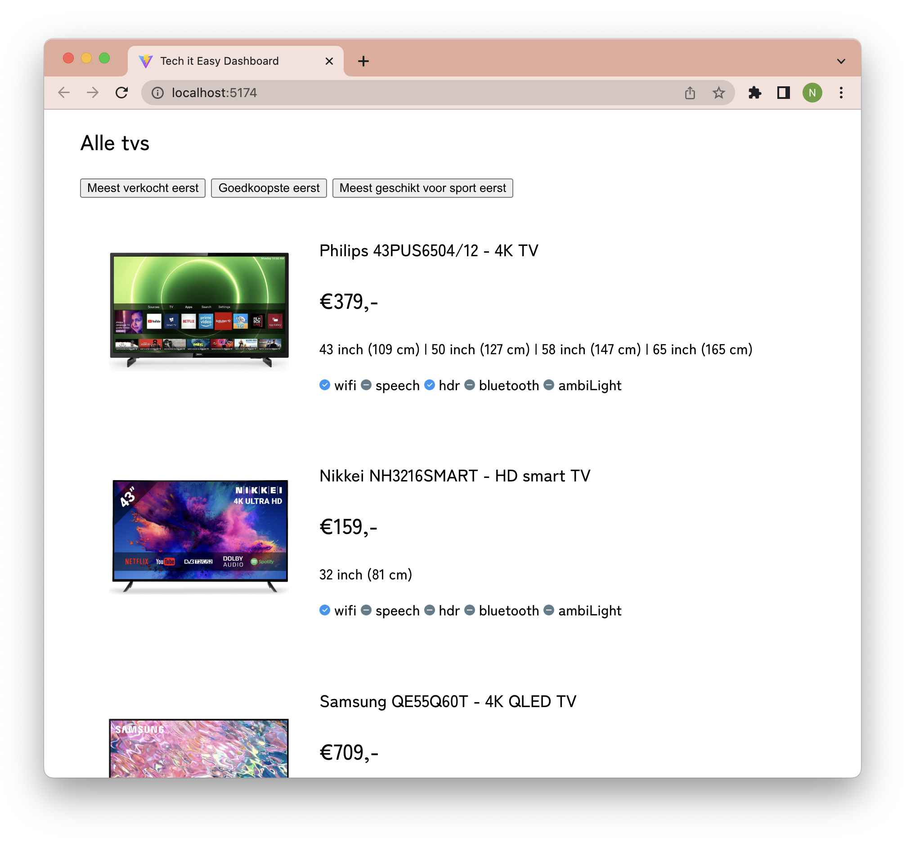

# Opdrachtbeschrijving

## Inleiding

Je bent net begonnen als developer bij een bedrijf genaamd _Tech It Easy_, dat TV's verkoopt. Recentelijk hebben ze Fred
van financieën ontslagen omdat hij telkens wel online was op Teams, maar eigenlijk dutjes deed en niets uitvoerde. Dit
betekent dat de medewerkers een financieel dashboard nodig hebben om zelf de administratie bij te houden.

Omdat Fred al heel lang niets heeft uitgevoerd is het niet zo goed gesteld met de financieën. Je kunt er daarom vanuit
gaan dat de voorraad met televisies op dit moment statisch is, maar in de toekomst dynamisch wordt.


In `constants/inventory.js` vind je 2 datasets. Eén object met de gegevens van de
bestverkochte tv bij Tech It Easy en één array met 8 objecten (alle tv's die zij verkopen). Elk tv-object bevat de
volgende informatie:

* `type` - het tv type
* `brand` - het merk
* `name` - de benaming
* `price` - de prijs (_in hele euro's_)
* `availableSizes` - een array met beschikbare schermgroottes voor dit model (_in inches_)
* `refreshRate` - de beeldverversing (_in Hz_)
* `screenType` - het type scherm (_LED - QLED - LCD_)
* `screenQuality` - de resolutie van het scherm (_Ultra HD/4K - Full HD - HD Ready_)
* `smartTv` - boolean waarde die aangeeft of het een Smart TV betreft
* `options` - een array met objecten waarin met booleans is aangegeven welke opties wel en niet aanwezig zijn (_Wifi,
  spraakbesturing, HDR, Bluetooth en AmiLight_)
* `originalStock` - de hoeveelheid exemplaren van dit type die tijdens deze voorraad-batch zijn ingekocht
* `sold` - de hoeveelheid verkochte exemplaren van dit type

## Deel 1

Door de opdrachten te maken bouw je langzaam het eerste deel van het Tech It Easy Dashboard op. Je bent vrij om de
styling van het voorbeeld over te nemen, of jouw eigen huisstijl te bedenken. Zorg er wel voor dat je eerst aan de slag
gaat met de technische opdrachten voor je jouw tijd besteed aan styling.



### Opdracht 1 - Helperfuncties

Je zult in deze opdracht meerdere helperfuncties gaan schrijven die we gaan gebruiken om de juiste informatie op
het dashboard weer te geven. Je gebruikt hier de data uit de `inventory`-array voor. Deze vind je in de `constants`-map.
_Tip:_ maak voor iedere helperfunctie een apart bestand en vergeet deze niet aan te roepen in `App.jsx`, anders blijft
de console leeg!

* **Opdracht 1a:** Hoeveel tv's zijn er al verkocht? Schrijf een helperfunctie die dit berekent. Log de uitkomst in de
  console.
* **Opdracht 1b:** Zorg ervoor dat dit aantal in het groen wordt weergegeven op de pagina.
* **Opdracht 1c:** Hoeveel tv's heeft Tech It Easy in totaal ingekocht? Schrijf een helperfunctie die dit berekent. Log
  de
  uitkomst in de console.
* **Opdracht 1d:** Zorg ervoor dat dit aantal in het blauw wordt weergegeven op de pagina.
* **Opdracht 1e:** Schrijf een helperfunctie die berekent hoeveel tv's er nog verkocht moeten worden. Geef de uitkomst
  in het rood weer op de pagina. _Tip:_ je kunt een helperfunctie gebruiken in een andere helperfunctie.

### Opdracht 2 - Productweergave

Je gaat verschillende helperfuncties schrijven om de informatie over één tv op de juiste manier op de pagina weer te
geven. Gebruik het `bestSellingTv`-object als input, maar houdt er rekening mee dat we hier ieder gewenst tv-object
voor moeten kunnen gebruiken. We gaan deze tv weergeven in het volgende format:

```shell
Samsung UHD 55AU7040 - Crystal
€549,-
43 inch (109 cm) | 50 inch (127 cm) | 55 inch (140 cm) | 65 inch (165 cm)
```

* **Opdracht 2a:** Maak een helperfunctie die een string genereert voor de naam van één tv en deze teruggeeft in het
  format `[merk] [type] - [naam]` zoals _Philips 43PUS6504/12 - 4K TV_ of _NIKKEI NH3216SMART - HD smart TV_.

* **Opdracht 2b:** Maak een helperfunctie die de prijs van één tv als parameter verwacht (zoals 379 of 159) teruggeeft
  in het format _€379,-_ of _€159,-_.

* **Opdracht 2c:** Maak een helperfunctie die een string genereert voor alle beschikbare schermgroottes van één tv. De
  functie geeft dit terug in het format:

```shell
[schermgrootte] inches ([schermgrootte omgerekend]cm) | [schermgrootte] inches ([schermgrootte omgerekend]cm) etc.
```

Als een tv maar één schermgrootte heeft (`[32]`) wordt de output `32 inch (81 cm)`. Wanneer een tv vier schermgroottes
heeft (`[43, 50, 55, 58]`) wordt de output `43 inch (109 cm) | 50 inch (127 cm) |
58 inch (147 cm)`. Rond altijd af op hele centimeters. Test goed of dit werkt met verschillende tv's!

* **Opdracht 2d:** Gebruik jouw helperfuncties om de informatie van de bestverkochte tv, inclusief afbeelding, op
  de pagina weer te geven:



* **Opdracht 2e:** gebruik de iconen uit de `assets`-map om weer te geven welke toepassingen aanwezig zijn op deze tv.
  Doe dit voor nu nog even door de informatie zelf, handmatig
  uit te typen (_hardcoded_).

```shell
[check-icon] wifi [not-icon] speech [check-icon] hdr [check-icon] bluetooth [not-icon] ambilight
```

* **Opdracht 2f:** Maak drie knoppen onderaan de pagina met daarop: 'Meest verkocht eerst', 'Goedkoopste eerst' en
  'Meest geschikt voor sport eerst'. Wanneer een knop wordt aangeklikt, moet de button-tekst in de console gelogd
  worden. _Tip:_ functies die worden uitgevoerd op basis van een event, declareer je altijd in het component zelf: dit
  zijn geen helpers.

## Deel 2

Je gaat verschillende methodes gebruiken om de informatie over alle tv's op een zo efficient mogelijke manier weer te
geven.
Gebruik de `inventory`-array als input en houdt er rekening mee dat het niet uit moet maken of de array 8 of 800 tv's
lang is.



### Opdracht 1 - Oefenen met array methodes

Voordat we array methodes gaan toepassen in React, is het belangrijk om nog even te oefenen met deze methodes in 'plain'
JavaScript. Maak de volgende opdrachten daarom in het `inventory.js` bestand, of maak zelf een eigen oefen-bestandje aan
in diezelfde map. Je kunt de `inventory`-array dan gewoon importeren. Je hoeft hiervoor geen functies te maken.
Log de uitkomsten telkens direct in de console.

* **Opdracht 1a:** Gebruik een array-methode om een array te maken met daarin alle tv-type namen. Log de uitkomst in de
  console.
* **Opdracht 1b:** Gebruik een array-methode om alle informatie te verzamelen van de tv's die volledig uitverkocht
  zijn. Log de uitkomst in de console.
* **Opdracht 1c:** Gebruik een array-methode om de informatie van het tv-type 'NH3216SMART' op te halen.
* **Opdracht 1d:** Gebruik een array-methode om een lijst te maken van de merk- en tv-namen waarbij aangegeven wordt of
  deze geschikt zijn voor sport-kijkers (een verversingssnelheid van 100Hz of hoger). Doe dit in het
  format `{ name: 'Toshiba HD TV', suitable: false }`. Log de uitkomst in de console.
* **Opdracht 1e (uitdaging):** Gebruik array-methoden om alle informatie te verzamelen van de tv's die beschikbaar zijn
  in
  schermgroottes van 65 inch en groter.
* **Opdracht 1f (uitdaging):** Gebruik array-methoden om alle informatie te verzamelen van de tv's die over
  ambilight beschikken. Log de uitkomst in de console.

### Opdracht 2 - Array methoden in de UI

* **Opdracht 2a:** Gebruik een array-methode om alle tv merken (zoals Philips, NIKKEI, etc.) in een lijst op de pagina
  weer te geven. Dit geeft het personeel een duidelijk overzicht van wat zij verkopen. Dat er dubbele merknamen in
  komen, is niet erg.

* **Opdracht 2b:** Gebruik een array-methode om alle tv's van Tech It Easy weer te geven in hetzelfde format als de best
  verkochte tv. Gebruik hiervoor
  ook de helperfuncties die je hebt gemaakt tijdens deel 1, maar sla de opties (zoals bluetooth, wifi, etc.) nog even
  over.

* **Opdracht 2c:** Gebruik opnieuw een array-methode om voor iedere tv alle optie-namen (zonder iconen) weer te geven in
  een lijst.

* **Opdracht 2d:** Voeg nu de iconen toe door gebruik te maken van een beslisboom binnen de methode. Wanneer de waarde
  van de optie `true` is, willen we het check-icoon weergeven en wanneer de waarde van de optie `false` is, het
  minus-icoon.

### Opdracht 3 - Sorteren maar!

We kunnen de tv's helaas niet op de pagina laten sorteren door op de knoppen te klikken, daar
hebben we namelijk _State_ voor nodig. Daarom log je de gesorteerde tv's in de console.

* **Opdracht 3a:** Zorg ervoor dat wanneer een gebruiker op de 'Meest verkocht eerst'-knop klikt, de `inventory`-array
  wordt
  gesorteerd op aantal verkochte items van hoog naar laag. Log de uitkomst in de console.
* **Opdracht 3b:** Zorg ervoor dat wanneer een gebruiker op de 'Goedkoopste eerst'-knop klikt, de `inventory`-array
  wordt gesorteerd
  op prijs van laag naar hoog. Log de uitkomst in de console.
* **Opdracht 3c:** Zorg ervoor dat wanneer een gebruiker op 'Meest geschikt voor sport eerst'-knop klikt, de `inventory`
  -array wordt
  gesorteerd op verversingssnelheid van hoog naar laag. Log de uitkomst in de console.

### Bonus

* **Opdracht 1:** Maak nog een extra knop met daarop 'Grootste schermgroottes eerst'. Wanneer de gebruiker op deze knop
  klikt, worden de tv's gesorteert op basis van hun grootste schermgrootte.
* **Opdracht 2:** Sommige tv's zijn al uitverkocht. Om te voorkomen dat de medewerkers van Tech It Easy deze producten
  nog proberen te verkopen, willen we die tv's voorzien van een 'uitverkocht'-plaatje. Om de afbeelding alleen te laten
  zien als de conditie waar is, zul je de logica-operator `&&` moeten gebruiken:

```javascript
conditie && <element dat weergegeven moet worden als TRUE>
```

Voor de `?` plaats je de conditie die getoetst wordt (is de tv uitverkocht?). Als de conditie waar is, toon je het
plaatje door dit element achter de `&&` te zetten (zonder '').